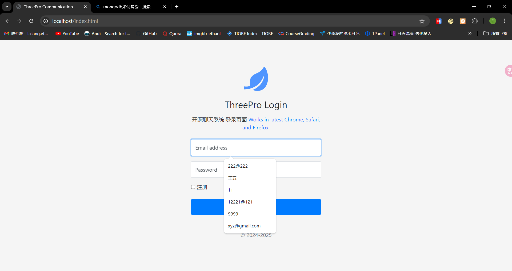
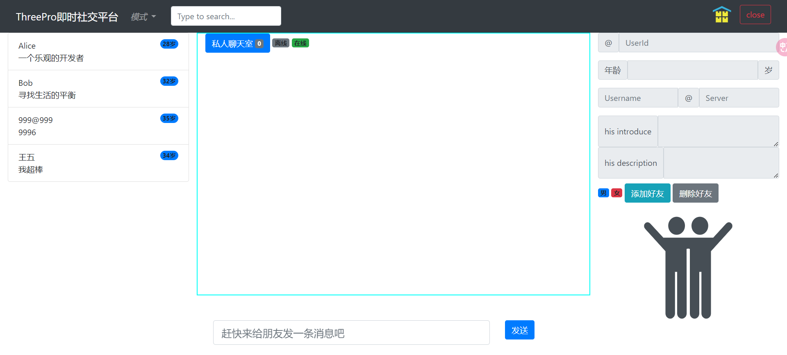
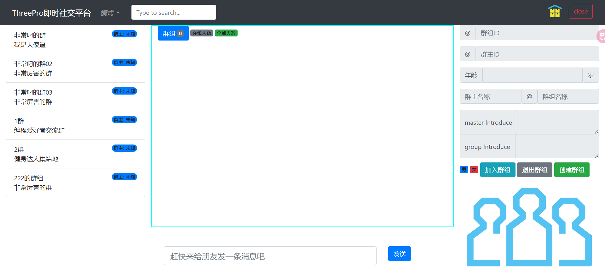
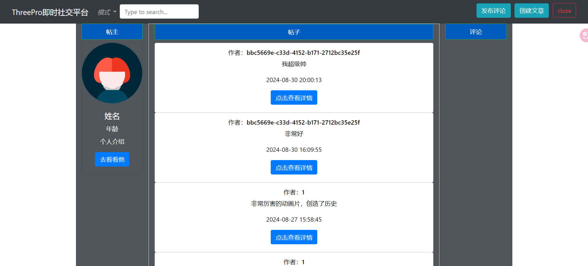

## ThreePro即时社交平台
**author Ethan**
- 本程序主要分为两部分分别是主平台渲染服务器（SpringBoot）和消息分发和存储服务器（Koa）
- 相关技术为
  - ### 后端 
    - SpringBoot
    - Koa+WebSocket
    - Alibaba druid
  - ### 前端
    - JQuery
    - Bootstarp相关组件
  - ### 数据库
    - MySQL
    - MongoDB
## 环境版本信息
- SpringBoot 3.0.3
- JQuery 3.7.1
- Koa 5.0.0
- Bootstarp4
- JDK21
- nodeJS 20.11.1
- MySQL 8.0.36
- MongoDB 3.6

## 项目启动
本项目为SpringBoot项目+Koa(koa+WebSocket)项目
SpringBoot项目部分为SpringBoot程序正常启动流程
NodeJS项目启动需要运行
```console
node ./main.js
```
运行前请安装完整依赖

构建工具
- npm
- Maven
启动之后可以直接打开浏览器窗口访问
- localhost/index.html
就可以看到登陆页面
- 
进入页面之后就可以访问我们的三项基本功能，私聊消息，群聊消息，朋友圈



本项目采用了Session的登陆验证，对于一些安全性方面还有诸多不完善， 功能还在不断完善中
诚邀大家提供反馈和社区贡献

